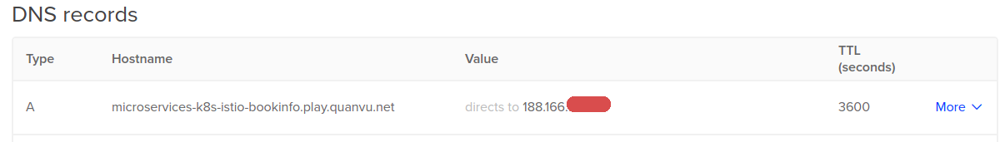

# Deploy Bookinfo sample based on Microservices with Kubernetes & Istio

This is a Guide for Deploy Bookinfo Application on K8s on Digitalocean.

## I. Setup Istio

Download the Istio release which includes installation files, samples, and the istioctl command line utility.

1. Go to the Istio release page to download the installation file corresponding to your OS. Alternatively, on a macOS or Linux system, you can run the following command to download and extract the latest release automatically:

    ```shell
    $ curl -L https://istio.io/downloadIstio | sh -
    ```

2. Move to the Istio package directory. For example, if the package is istio-1.4.3:

    ```shell
    $ cd istio-1.4.3
    ```

The installation directory contains:

- Installation YAML files for Kubernetes in install/kubernetes
- Sample applications in samples/
- The istioctl client binary in the bin/ directory. istioctl is used when manually injecting Envoy as a sidecar proxy.

3. Add the istioctl client to your path, on a macOS or Linux system:

```shell
$ export PATH=$PWD/bin:$PATH
```

Or you can add ISTIO_PATH to ~/.profile or ~/bashrc:

```shell
gedit ~/.profile

# Add ISTIO_PATH
# export ISTIO_PATH=$HOME/istio-1.4.3/bin
# export PATH=$ISTIO_PATH:$PATH
# source ~/.profile
```

You can optionally enable the auto-completion option when working with a bash or ZSH console.

## II. Deploy to Kubernetes cluster

Check out branch: **01-deploy-bookinfo-k8s-digitalocean**

```shell
kubectl apply -f k8s-specs/bookinfo.yaml
kubectl apply -f k8s-specs/bookinfo-gateway.yaml

```

**Optional:** If you want to use special sub-domain name for your Api Gateway update bookinfo-gateway.yaml like this

1. Update bookinfo-gateway.yaml use custom domain

    ```
    # bookinfo-gateway.yaml
    servers:
    - port:
        number: 80
        name: http
        protocol: HTTP
            hosts:
            - microservices-k8s-istio-bookinfo.play.quanvu.net

    ```

2. Add Config DNS record:

    

3. Apply change to K8s cluster

    ```shell
    $ kubectl apply -f k8s-specs/bookinfo-gateway.yaml
    ```

4. Open app on browser to check it.

    

## III. Cleanup Bookinfo application on cluster

To clean up this sample project on your Kubernets cluster run this command:

```shell
./cleanup.sh
```

## Reference

- https://kubernetes.io/
- https://istio.io/